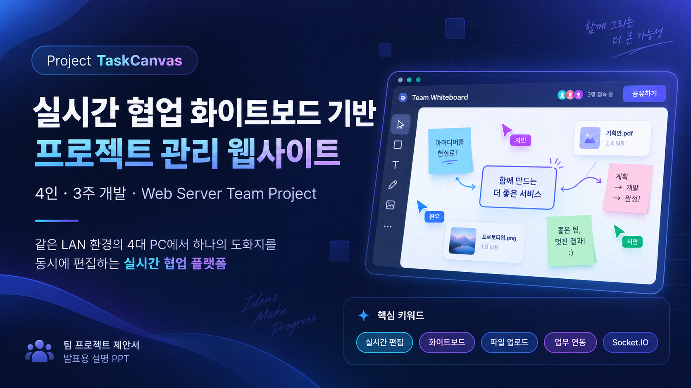

# TaskCanvas

**실시간 협업 화이트보드 기반 프로젝트 관리 웹사이트** · 웹서버 수업 팀 프로젝트 · 기획 및 개발 준비 초기 버전

> **현재 상태:** P0 기능(게스트 입장, 보드, 실시간 펜·도형·커서, 선점 잠금, 이미지·영상, 저장·복원, 권한)이 `apps/` 에 구현되어 있고, 수용 테스트 AC01~AC14 가 개발 PC 에서 통과했습니다(`apps/realtime` 의 `npm run test:acceptance`). P1 의 공유 업무 블럭·연결선·다중 선택·초대 코드 관리·크기 조절·메모·보드 관리(AC16~AC23)도 구현되었고, 학교 PC 4대 실환경(AC15)만 현장 확인이 남았습니다. `presentation/`의 화면은 기획용 콘셉트 이미지입니다.

---

## 1. 프로젝트 핵심 목표

학교 PC에서 **XAMPP(Apache/PHP) + Node.js/Socket.IO + MySQL**을 사용하고, 동일 LAN의 **PC 4대**가 하나의 화이트보드를 동시에 편집합니다.

- **4명 / 3주 / 초보자 중심:** 기획·통합 담당 1명, 프론트엔드 1명, 실시간 서버 1명, PHP·DB 1명
- **접속:** 이름과 유효한 초대 코드를 이용한 게스트 입장 (일반 회원가입은 3주 MVP에서 제외)
- **핵심 조작:** 그리는 중 실시간 펜, 도형, 사용자별 커서, 객체 편집 잠금, 이미지 추가, URL 영상 임베드
- **저장:** 작업이 확정되면 DB에 기록. 끊긴 뒤 재접속 시 **마지막 저장 상태**로 복원 (미저장 작업은 복구 대상 아님)
- **이미지:** PNG·JPG·WEBP, **파일당 최대 10 MB**, 업로드 버튼·드래그·붙여넣기
- **P1 목표:** 동일 원본 업무를 복수 보드에 표시하고 업무 상태 변경을 공유
- **후속 개발:** 고급 표 편집, 고급 업무 체크리스트/댓글, 흐름도 자동 배치, 전체 기능 확장

---

## 2. 구현 범위

| 단계 | 우선순위 | 항목 |
|---|---|---|
| 핵심 시연 | P0 | 게스트 입장, 보드 생성·전환, 실시간 펜·도형·커서·잠금, 이미지·영상, 작업 확정 저장 및 복원, 접근 권한 |
| P0 완료 후 | P1 | 공유 업무 블럭, 연결선·관계 라벨, 다중 선택, 격자 정렬, 보조 초대 흐름 |
| 추후 | P2 | 고급 체크리스트·댓글·파일 첨부 업무, 스프레드시트급 표, 흐름도 자동 정렬 |

**합격 조건:** PC 4대에서 입장 → 펜·객체 실시간 편집 → 이미지·영상 표시 → 저장 → 새로고침·재접속 시 정상 복원. 자세한 판정은 [수용 테스트](docs/11-acceptance-tests.md)를 참고합니다.

---

## 3. 팀 역할

| 구분 | 역할 | 산출물 |
|---|---|---|
| A (본인) | 기획·통합·테스트 | 기능 명세, 역할 조율, Git 통합, QA, 발표 |
| B | 프론트엔드 | 화이트보드 캔버스, 조작 UI, 이미지·영상 표시 |
| C | 실시간 서버 | Socket.IO, 펜·커서 동기화, 선점 잠금, 확정 이벤트 |
| D | 백엔드·DB | PHP API, 게스트 입장, 프로젝트/보드, 이미지 저장, DB |

팀원은 일부만 확정되었습니다. 사용자명이나 계정 정보를 임의로 작성하지 않았습니다.

---

## 4. 저장소 안내

| 경로 | 내용 |
|---|---|
| `docs/` | 1~4차 기획 결정, 기능·화면·기술·API·DB·테스트·위험 문서 |
| `docs/original/` | 이전에 작성한 Google 문서의 Markdown 내보내기(1차 기획 스냅샷) |
| `database/schema.sql` | DB 초안 스키마. 운영 전에 팀 검토 및 수정 필요 |
| `presentation/` | 실제 제작한 12장 PPT, 10장 디자인 PPT, 미리보기 이미지 |
| `assets/design/` | 생성한 콘셉트 슬라이드 10장과 제공된 화면 참고 이미지 |
| `assets/components/` | PPT 내부에 포함된 UI·역할 이미지 안내(개별 크롭 파일 미첨부) |
| `apps/` | 구현 코드. `php-api/`(1·5·7·9단계: 입장·세션·보드·스냅샷·티켓·이미지 업로드·업무 조회·초대 코드 관리), `realtime/`(2·4·5단계: 보드 참여·커서·펜·도형·이미지·영상 저장·선점 잠금·버전 검사), `frontend/`(3~5·7·8단계: 입장·보드·화이트보드·선택/이동/삭제·이미지·영상·공유 업무 블럭·연결선·다중 선택) |
| `scripts/start-dev.bat` | MariaDB·실시간 서버·PHP 서버를 한 번에 띄우는 Windows 실행 스크립트 |
| `scripts/reset-demo.bat` | 시연 초기화(전체 데이터·업로드 이미지 삭제 후 시연 프로젝트·초대 코드 생성). `--dry-run` 으로 먼저 확인 |
| `PUSH_GUIDE.md` | GitHub 업로드 및 권한 복구 안내 |

- [전체 문서 목차](docs/README.md)
- [요구사항 의사결정 로그](docs/01-decisions-questionnaires.md)
- [기능 정의와 우선순위](docs/02-requirements-mvp.md)
- [시스템 구조](docs/05-architecture.md)
- [3주 역할별 WBS](docs/10-wbs-timeline.md)
- [수용 기준](docs/11-acceptance-tests.md)
- [학교 PC 배포·시연 가이드](docs/15-deployment-school-pc.md)
- [원본 Google 기획서](https://docs.google.com/document/d/1OYAsiMSTDTKa1uIx4RwsZnK_TBrR2bgbeYqXM2kE5Sc/edit)

---

## 5. 시작 전 필수 확인

1. 학교 PC에서 XAMPP·Node.js 실행 권한, 방화벽 및 Socket.IO 포트 허용을 **첫날 확인**.
2. PHP/Node 인증 연결과 보드 객체 이벤트의 JSON 스키마를 모두가 합의.
3. 첫 주에는 PC 2대 펜 동기화에 도달. 둘째 주에는 4인 동시 편집·저장·복원에 도달.
4. 셋째 주 후반 신규 기능보다 P0 안정화에 집중.
5. 실제 비밀번호·초대 코드·토큰·업로드 이미지 등 민감하거나 실행 시 생성된 데이터는 Git에 추가하지 않음.

---

## 6. 주의

- 기술 구조와 이벤트명은 **설계 초안**입니다. 실제 API와 구현 경로를 확정한 뒤 정식 계약으로 갱신해야 합니다.
- 스냅샷 문서와 PPT는 이전 기획 과정의 산출물이므로 **최종 4차 결정 사항과 일부 차이**가 있습니다. 최신 기준은 `README.md`, `docs/01-decisions-questionnaires.md`입니다.
- 저장소와 문서의 공개 범위에 유의하십시오. 실제 팀원의 개인정보, 미공개 계정, 접근 가능한 초대코드·인증 정보는 공개 저장소에 올리지 않습니다.
