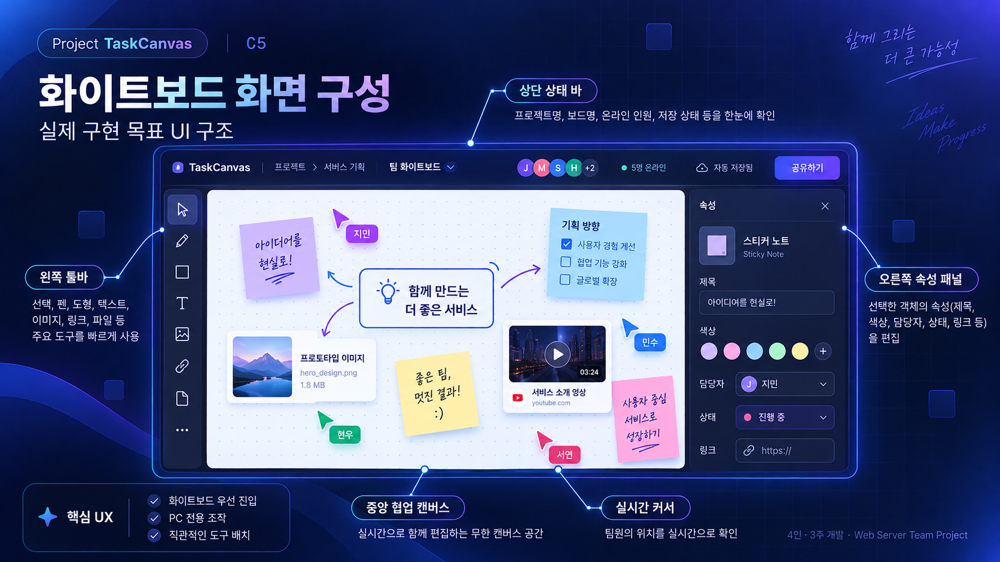

# UI / 화면 구성 명세

---

## 화면 구조

| 화면 | 필수 요소 |
|---|---|
| 게스트 입장 | 이름 입력, 초대 코드, 접속 오류 알림 |
| 프로젝트 선택 | 현재 참여 프로젝트, 보드 목록, 권한 표시 |
| 화이트보드 | 상단 상태바, 왼쪽 도구, 중앙 도화지, 오른쪽 속성 |
| 파일 업로드 | 업로드 진행·형식 제한·실패 알림 |
| 연결 오류 | 연결 끊김, 저장 여부, 재접속 알림 |

---

## 보드 주요 영역

- **상단 바:** 프로젝트·보드명, 접속자(최대 4명 시연), 저장/연결 상태, 보드 선택.
- **왼쪽 툴바:** 선택, 이동, 펜, 사각형·원, 텍스트/메모(확장), 이미지, 영상 링크, 업무 블럭(P1).
- **중앙 캔버스:** 자유 배치·줌·팬, 격자 표시, 서로 다른 색상의 사용자 커서.
- **오른쪽 속성:** 객체 유형에 따라 색상·굵기·크기·제목·URL·담당자(P1).

---

## 조작 사양

| 조작 | 제안 동작 |
|---|---|
| 펜 | 누름→이동 중 미리보기→놓으면 저장 |
| 도형 | 도구 선택 후 마우스 드래그로 생성 |
| 도형 이동 | 선택→잠금 획득→이동→마우스 놓으면 확정 |
| 보드 이동 | Space + 드래그 또는 이동 도구 |
| 확대·축소 | 마우스 휠, 화면 맞춤 버튼 |
| 파일 추가 | 버튼, 파일 드래그, 이미지 Ctrl+V |
| 영상 | URL 카드 생성, 허용된 외부 임베드 |
| 다중 선택(P1) | Shift+클릭 또는 영역 선택; 잠금은 선택한 객체 전체에 적용 |

---

## 사용자 안내

- `연결됨/재접속 중/연결 끊김` 상태를 명시.
- `저장 중/저장됨/저장 실패`를 서버 응답 기준으로 명시.
- 잠긴 객체에는 사용자 이름과 읽기 전용 시각 표시.
- 프론트엔드 코드에서 이벤트를 처리하기 전에 사용자 권한을 숨기는 것은 UX용이며, 서버에서도 동일한 권한 검사가 필수.
