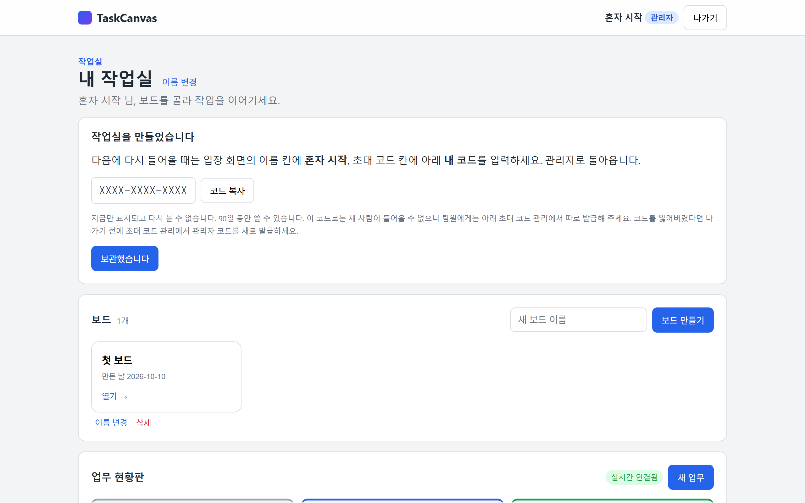
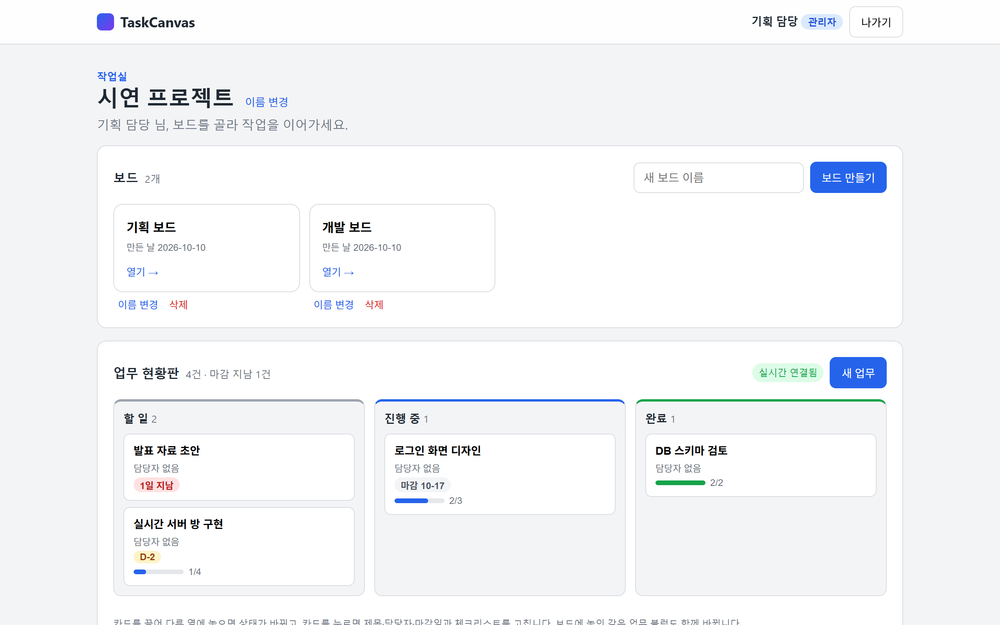
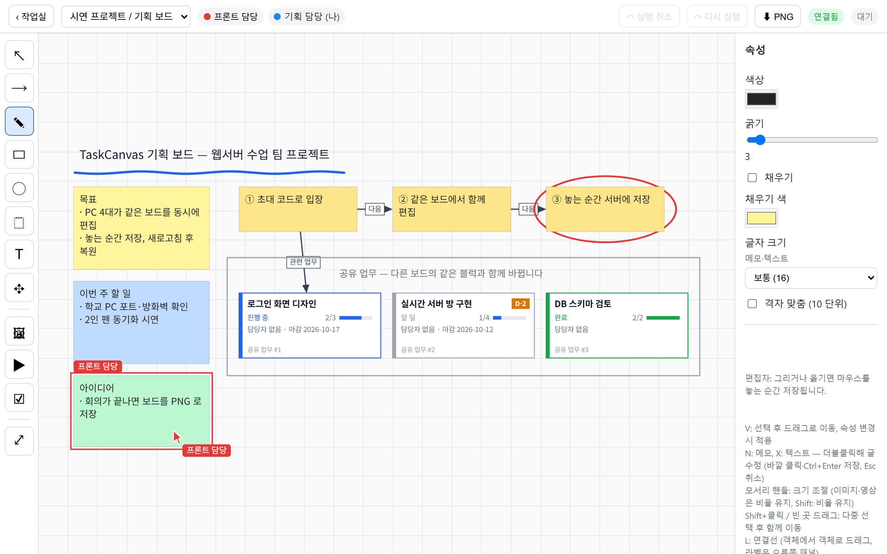

# UI / 화면 구성 명세

구현된 화면 기준입니다(16단계). 조작 하나하나의 동작은 [apps/frontend/README.md](../apps/frontend/README.md)의 표가 가장 자세합니다.

---

## 화면 구조

| 화면 | 요소 |
|---|---|
| 홈 — 소개 | 처음 열면 보이는 기능 소개. "새 작업실 만들기"와 "초대 코드로 입장" 두 갈래. 기능 6가지는 그림이 들어간 카드를 좌우 화살표와 아래 점으로 한 장씩 넘겨 봄 |
| 작업실 만들기 | 표시 이름, 작업실 이름. 만들면 관리자로 바로 입장 |
| 게스트 입장 | 이름 입력, 초대 코드, 접속 오류 알림, 작업실 만들기 링크, 접속 점검 링크 |
| 홈 — 작업실 | 입장하면 같은 홈이 바뀜. 작업실 이름(관리자는 변경 가능), 보드 목록(생성·이름 변경·삭제), 업무 현황판, 참여자와 역할, 관리자용 초대 코드 관리. 직접 만든 직후에는 재입장용 "내 코드" 안내가 맨 위에 보임 |
| 화이트보드 | 상단 상태바, 왼쪽 도구, 중앙 도화지, 오른쪽 속성 |
| 접속 점검 | 입장 없이 이 PC 에서 웹 서버·실시간 서버·외부 영상에 닿는지 확인 (`/check.html`) |

이미지 업로드와 연결 오류는 별도 화면이 아니라 보드 안의 안내(저장 상태, 알림 문구)로 처리합니다.

---

## 직접 만든 작업실

- **내 코드 카드:** 만든 직후에만 보입니다. 다시 들어올 때 쓸 이름과 코드, 복사 버튼, 유효 기간 안내가 있고 **보관했습니다**를 누르거나 나가면 사라집니다. 화면 캡처에는 실제 코드 대신 자리 표시 글을 넣었습니다.
- **처음 상태:** 첫 보드 하나, 빈 업무 현황판, 참여자는 만든 사람 한 명, 초대 코드 관리에는 재입장 전용 코드 한 줄.

---

## 작업실의 업무 현황판

- **세 열:** 할 일·진행 중·완료. 열마다 업무 수를 보여 주고, 열 안에서는 마감이 이른 순으로 놓습니다.
- **카드:** 제목, 담당자, 마감 표시, 체크리스트가 있으면 진행 막대와 `2/5`. 끌어서 다른 열에 놓으면 상태가 바뀌고, 누르면 제목·상태·담당자·마감일과 체크리스트를 고치는 대화상자가 열립니다. 키보드로는 Tab 으로 카드를 골라 Enter 로 엽니다.
- **체크리스트:** 대화상자와 보드의 오른쪽 패널에 같은 모양으로 들어갑니다. 제목 줄에 진행 막대와 `2/5`, 그 아래 항목마다 체크 상자·이름·삭제(×), 맨 아래에 추가 칸과 **추가** 버튼. 끝낸 항목은 흐리게 줄을 긋습니다. 바꾸는 즉시 저장되므로 저장 버튼과 따로 움직입니다. 열람자는 패널과 대화상자를 열 수 없어 카드와 블럭의 진행률만 봅니다. 작업실의 실시간 연결이 끊긴 동안에는 체크 상자가 꺼지고 추가 칸과 삭제 버튼이 숨겨집니다.
- **마감 표시:** 지난 업무는 빨강(`n일 지남`), 오늘과 3일 안은 주황(`오늘 마감`, `D-n`), 그보다 여유 있으면 회색(`마감 MM-DD`). 완료 열에서는 경고 색을 쓰지 않습니다. 보드의 업무 블럭 오른쪽 위에도 같은 기준으로 붙습니다.
- **오른쪽 위:** 실시간 연결 상태와 **새 업무** 버튼. 연결되지 않았거나 열람자이면 카드를 볼 수만 있습니다.

---

## 보드 주요 영역

- **상단 바:** 작업실로 돌아가기, 보드 전환, 접속자(시연 기준 4명), 실행 취소·다시 실행, PNG 내보내기, 연결 상태, 저장 상태. 다른 접속자의 이름은 누를 수 있는 이름표로, 한 번 누르면 그 사람이 있는 곳으로 이동하고 한 번 더 누르면 계속 따라갑니다. 따라가는 동안에는 이름표가 강조되고 캔버스 위쪽에 안내와 **그만 따라가기** 버튼이 뜹니다.
- **왼쪽 툴바:** 선택, 연결선, 펜, 사각형, 원, 메모, 텍스트, 이동, 이미지, 영상, 업무 블럭, 화면 맞춤.
- **중앙 캔버스:** 자유 배치·확대·이동, 격자 표시, 서로 다른 색상의 사용자 커서와 잠금 표시. 다른 참여자의 커서는 그 사람 색의 화살표와 이름표로 보이고 5초 넘게 멈추면 흐려집니다. 다른 참여자가 고른 객체는 그 사람 색의 실선 테두리와 이름표로, 편집 중인 객체는 점선 테두리와 "편집 중" 이름표로 구분합니다. 내 선택은 파란 점선입니다.
- **오른쪽 속성:** 색상·굵기·채우기·글자 크기·격자 맞춤. 업무 블럭을 고르면 제목·상태·담당자·마감일과 체크리스트, 연결선을 고르면 라벨. 아래에 단축키 안내.

기획 단계의 콘셉트 그림은 [assets/design/05-whiteboard.png](../assets/design/05-whiteboard.png)에 남아 있습니다.

---

## 조작 사양

| 조작 | 동작 |
|---|---|
| 펜 (P) | 누름→이동 중 미리보기→놓으면 저장 |
| 도형 (R·O) | 도구 선택 후 마우스 드래그로 생성 |
| 메모 (N)·텍스트 (X) | 클릭하거나 끌어서 놓고 바로 글 입력. 더블클릭해 수정, 글자 크기는 오른쪽 패널 |
| 이동·크기 조절 (V) | 선택→잠금 획득→끌기→놓으면 확정. 모서리 핸들로 크기 조절 |
| 다중 선택 | Shift+클릭 또는 영역 선택. 잠금은 선택한 객체 전체에 적용 |
| 연결선 (L) | 객체에서 객체로 드래그, 라벨은 오른쪽 패널 |
| 실행 취소·다시 실행 | Ctrl+Z, Ctrl+Y(또는 Ctrl+Shift+Z) |
| 복제·삭제 | Ctrl+D, Delete |
| 보드 이동 | Space + 드래그 또는 이동 도구 (H) |
| 확대·축소 | 마우스 휠, 화면 맞춤 버튼 |
| 이미지 추가 | 버튼, 파일 드래그, 이미지 Ctrl+V |
| 영상 | ▶ 버튼에 YouTube·Vimeo URL 입력, 보드 안에서 재생 |
| 업무 블럭 (T) | 기존 업무를 고르거나 새로 만들어 배치 |
| PNG 내보내기 | 상단 ⬇ PNG |

---

## 사용자 안내

- `연결됨/재접속 중/연결 끊김` 상태를 명시.
- `저장 중/저장됨/저장 실패`를 서버 응답 기준으로 명시.
- 잠긴 객체에는 잡고 있는 사람의 색으로 점선 테두리와 "이름 편집 중" 이름표를 표시.
- 열람자는 도구가 비활성화되고 화면 이동만 가능. 화면에서 숨기는 것은 UX용이며, 서버에서도 같은 권한 검사를 함.
- 화면은 PC 브라우저 전체 크기에 맞춰져 있음. 모바일 화면은 다루지 않음.
