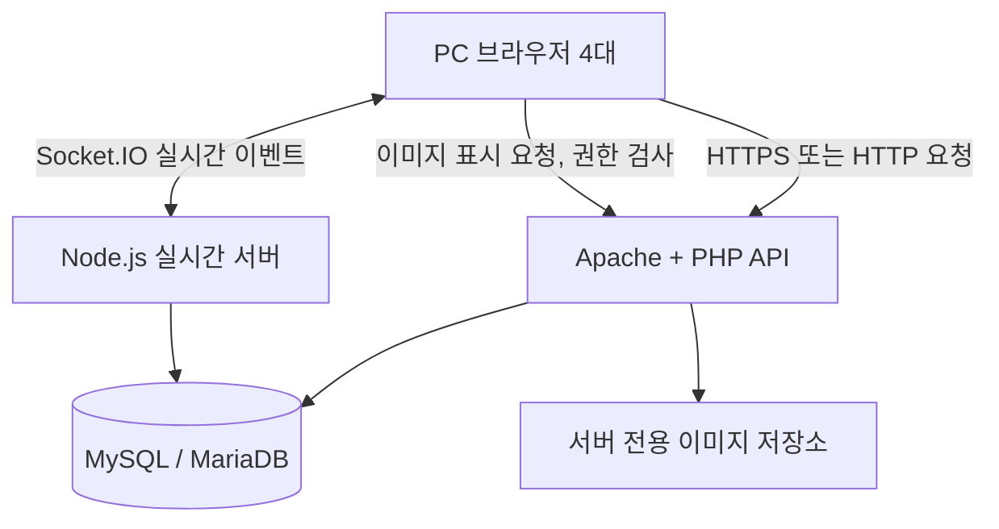

# 시스템 기술 구조

---

## 기본 아키텍처

---

## 역할별 책임

| 구성요소 | 책임 |
|---|---|
| 브라우저 | UI·캔버스 렌더링, 마우스 입력, 펜 부분 좌표·커서 송신 |
| Apache/PHP | 초대 코드·게스트 세션·프로젝트/보드 조회·이미지 업로드·접근 권한 |
| Node.js/Socket.IO | 보드 참여, 동기화 이벤트, 객체 잠금, 최종 객체 저장 경로 |
| MySQL | 게스트·초대·보드·저장 완료된 객체·원본 업무(P1) |
| 디스크 | 검증한 이미지 원본. 공개 정적 업로드 폴더 금지 |

---

## 인증 경계

1. PHP가 입력된 게스트 이름과 초대 코드를 검증하고 서버 세션 생성.
2. 게스트가 현재 접근 가능한 보드에 대해 **짧은 유효기간의 일회성 실시간 접속 티켓**을 PHP에 요청.
3. Node.js는 서명/공유 저장소 검증으로 티켓을 확인하고 지정된 보드 방에만 참여시킴.
4. Node.js의 모든 **수정** 이벤트에서 게스트의 현재 프로젝트 역할과 보드 포함 여부를 재확인.
5. 클라이언트에서 보내는 `guest_id`, `role`, `file_path`를 신뢰하지 않음.

---

## 학교 PC 운영

- 첫날 학교 PC의 설치·실행 권한, XAMPP 포트(예: 80 또는 8080), Node.js 포트(예: 3001), Windows 방화벽을 확인.
- 브라우저의 `localhost`는 **각 PC 자신**입니다. 다른 PC에서는 서버 PC의 LAN IP로 접속해야 함.
- 학교 LAN의 기기 간 통신이 차단될 수 있으므로 사전 테스트 필수.
- 운영 환경에서 HTTPS/WSS를 권장. 실습 LAN에서 HTTP로 시연한다면 공개망 배포를 피하고 토큰·초대 코드를 노출하지 않도록 관리.

---

## DB 기록 경로

- 펜 미리보기·커서·드래그 미리보기 → Socket.IO 메모리 이벤트, **DB 기록 없음**.
- 펜 확정·객체 확정·객체 삭제·업무 확정 → 권한·잠금·버전 검사 후 DB 저장.
- 브라우저는 **DB 저장 성공 응답**을 받은 후에만 `저장됨`을 표시.
- 저장 실패 시 경고 후 서버 스냅샷 재동기화.
