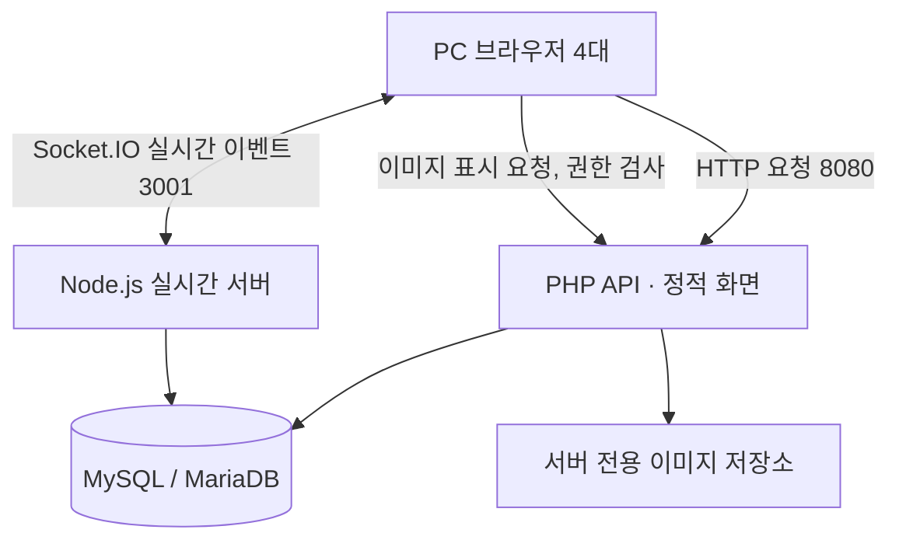

# 시스템 기술 구조

구현된 구조 기준입니다(16단계).

---

## 기본 아키텍처

화면은 프레임워크와 빌드 도구 없이 HTML·CSS·JavaScript 와 Canvas API 로 만들었습니다. 시연에서는 PHP 내장 서버(8080)가 화면과 API 를 함께 제공하고, XAMPP 의 Apache 로도 서비스할 수 있습니다.

---

## 역할별 책임

| 구성요소 | 책임 |
|---|---|
| 브라우저 | UI·캔버스 렌더링, 마우스 입력, 펜 부분 좌표·커서 송신, 실행 취소 기록 |
| PHP API | 초대 코드·게스트 세션·프로젝트/보드 조회와 관리·이미지 업로드·접근 권한·실시간 티켓 발급 |
| Node.js/Socket.IO | 보드 참여, 동기화 이벤트, 객체 잠금, 객체·업무·연결선의 저장 경로 |
| MySQL | 게스트·초대·보드·저장 완료된 객체·연결선·원본 업무·이미지 메타데이터·티켓 |
| 디스크 | 검증한 이미지 원본(`apps/php-api/storage/uploads`). 웹 루트 밖이며 직접 접근 차단 |

---

## 인증 경계

1. PHP가 입력된 게스트 이름과 초대 코드를 검증하고 서버 세션을 만든다. 세션 토큰은 HttpOnly·SameSite=Strict 쿠키로만 전달하고 DB 에는 해시만 둔다.
2. 게스트가 접근할 수 있는 보드에 대해 **60초 유효·일회성 실시간 접속 티켓**을 PHP에 요청한다.
3. Node.js는 두 서버가 함께 쓰는 DB 의 `realtime_tickets` 테이블로 티켓을 확인하고(한 번 쓰면 다시 못 씀) 지정된 보드 방에만 참여시킨다.
4. Node.js의 모든 **수정** 이벤트에서 게스트의 현재 프로젝트 역할과 보드 포함 여부를 다시 확인한다.
5. 클라이언트에서 보내는 `guest_id`, `role`, `file_path`를 신뢰하지 않는다.
6. 상태를 바꾸는 HTTP 요청은 `X-TaskCanvas` 헤더를 요구한다(CSRF 방어). 실시간 서버는 자기와 같은 호스트에서 열린 페이지의 연결만 받는다(`CORS_ORIGIN=auto`).

---

## 학교 PC 운영

- 첫날 `scripts\check-env.bat` 으로 서버 PC 의 PHP·Node·DB·포트·방화벽을 확인하고, 접속 PC 에서는 브라우저로 `/check.html` 을 열어 확인한다.
- 포트는 화면·API 8080, 실시간 3001. 두 포트 모두 Windows 방화벽에서 들어오는 연결을 허용해야 한다.
- 브라우저의 `localhost`는 **각 PC 자신**이다. 다른 PC에서는 서버 PC의 LAN IP로 접속해야 한다.
- 학교 LAN의 기기 간 통신이 차단될 수 있으므로 사전 테스트가 필수다.
- 운영 환경에서는 HTTPS/WSS를 권장한다. 실습 LAN에서 HTTP로 시연하므로 공개망에 그대로 올리지 않고, 초대 코드는 시연 뒤 취소한다.
- 자세한 절차는 [배포·시연 가이드](15-deployment-school-pc.md)에 있다.

---

## DB 기록 경로

- 펜 미리보기·커서·드래그 미리보기 → Socket.IO 메모리 이벤트, **DB 기록 없음**.
- 펜 확정·객체 확정·객체 삭제·업무 확정·연결선 → 권한·잠금·버전 검사 후 DB 저장.
- 브라우저는 **DB 저장 성공 응답**을 받은 후에만 `저장됨`을 표시.
- 저장 실패 시 경고 후 서버 스냅샷 재동기화.
- 보드 이름 변경·삭제는 PHP API 가 처리하고, 실시간 서버가 DB 를 5초 주기로 확인해 그 보드의 참여자에게 알린다.
