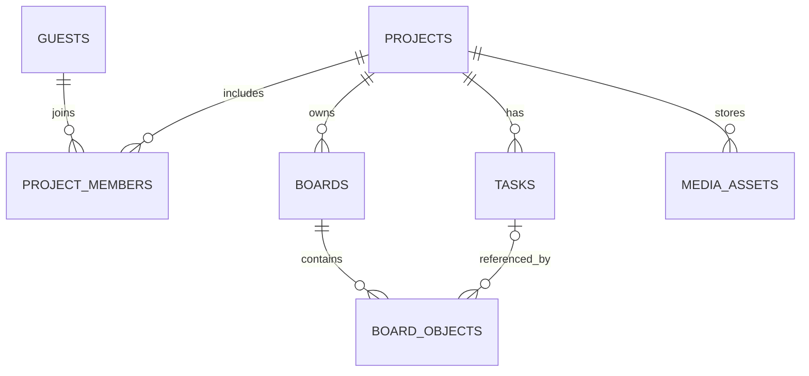

# 데이터베이스 설계

---

## 테이블 목록

| 테이블 | 주요 컬럼 | 규칙 |
|---|---|---|
| `guests` | guest_id, display_name, created_at | 코드 입장을 위한 게스트 ID |
| `guest_sessions` | session_token_hash, guest_id, expires_at | 세션 원문 저장 금지 |
| `projects` | project_id, title, created_by | 프로젝트 |
| `project_invites` | invite_id, project_id, code_hash, role, max_uses, used_count, expires_at | 초대 코드 평문 금지. `max_uses` 가 NULL 이면 인원 제한 없음, `used_count` 는 그 코드로 새로 입장한 인원 |
| `project_members` | project_id, guest_id, role | 복합 키로 중복 방지 |
| `boards` | board_id, project_id, title | 프로젝트별 여러 보드 |
| `board_objects` | object_id, board_id, task_id, type, x, y, width, height, payload_json, style_json, version | 최종 확정된 객체만 저장 |
| `media_assets` | asset_id, project_id, stored_path, mime_type, size_bytes | 이미지 파일 메타데이터 |
| `tasks` (P1) | task_id, project_id, title, status, assignee_id, due_at | 보드와 독립된 업무 원본 |
| `board_links` (P1) | link_id, board_id, from_object_id, to_object_id, label | 양 끝 객체의 보드 일치 검사 (8단계 구현: 실시간 서버가 두 객체가 같은 보드에 있는지 확인, 객체 삭제 시 FK 연쇄 삭제) |
| `realtime_tickets` | ticket_hash, guest_id, board_id, project_id, expires_at, used_at | Socket.IO 일회성 접속 티켓. 원문 저장 금지. 보드 티켓은 `board_id` 만, 작업실 연결용 티켓은 `project_id` 만 채움(17단계) |
| `join_attempts` | client_ip, succeeded, attempted_at | 게스트 입장 요청 제한용 기록 |

---

## 참조 구조

---

## 데이터 동작 원칙

- `board_objects`의 `type='task'`일 때만 `task_id`를 원본 업무에 연결. (7단계 구현: 블럭 자체는 `payload={}` 이고 제목·상태·담당자·마감일은 `tasks` 원본에서 가져와 그림)
- `type='note'`(메모·텍스트)는 `payload_json.text` 에 글, `style_json` 에 `fill`(배경 색, null 이면 배경 없는 텍스트)·`color`(글자 색)·`size`(글자 크기 10~72, 없으면 16)를 저장. 별도 테이블 없이 `board_objects` 만 사용.
- 이미지 객체를 지워도 `media_assets` 행과 파일은 남습니다(지운 사람이 실행 취소로 되살릴 수 있어야 함). 어느 보드의 이미지 객체도 가리키지 않는 행은 `apps/php-api/bin/clean-uploads.php` 가 파일과 함께 정리합니다.
- `database/schema.sql` 에 컬럼을 더하거나 NULL 을 허용하게 바꾸면 `apps/php-api/src/Schema.php` 에도 적어, 예전에 만든 DB 가 `bin/migrate.php` 로 따라올 수 있게 합니다.
- 업무 원본(`tasks`)은 보드에 블럭이 없어도 존재할 수 있고, 작업실의 업무 현황판은 프로젝트의 모든 업무를 보여 줍니다. 업무를 지우는 기능은 없습니다.
- 두 보드에 같은 원본 업무를 배치해도 각 보드의 객체 좌표는 독립.
- 한 보드에서 공유 업무 블럭을 삭제하면 해당 `board_objects`만 삭제.
- 잠금은 실시간 서버의 TTL 상태로 관리하며 DB에 영구 보관하지 않음.
- 게스트 세션이 만료되어도 프로젝트의 완료된 객체와 원본 업무는 보존.
- MySQL 8 또는 XAMPP에 포함된 MariaDB 버전의 JSON/제약 호환성 확인 필요.

---

## SQL

[database/schema.sql](../database/schema.sql)이 구현에서 쓰는 스키마입니다. 테이블을 바꾸면 그 파일과 이 문서를 함께 고칩니다.
