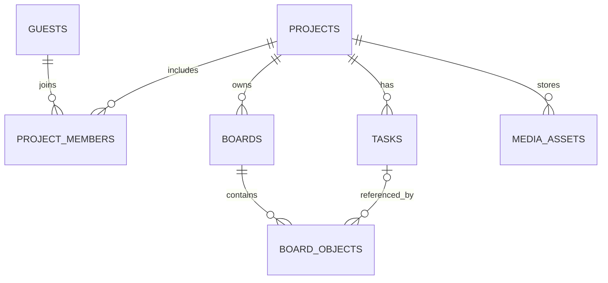

# 데이터베이스 설계

---

## 테이블 목록

| 테이블 | 주요 컬럼 | 규칙 |
|---|---|---|
| `guests` | guest_id, display_name, created_at | 코드 입장을 위한 게스트 ID |
| `guest_sessions` | session_token_hash, guest_id, expires_at | 세션 원문 저장 금지 |
| `projects` | project_id, title, created_by | 프로젝트 |
| `project_invites` | invite_id, project_id, code_hash, role, expires_at | 초대 코드 평문 금지 |
| `project_members` | project_id, guest_id, role | 복합 키로 중복 방지 |
| `boards` | board_id, project_id, title | 프로젝트별 여러 보드 |
| `board_objects` | object_id, board_id, task_id, type, x, y, width, height, payload_json, style_json, version | 최종 확정된 객체만 저장 |
| `media_assets` | asset_id, project_id, stored_path, mime_type, size_bytes | 이미지 파일 메타데이터 |
| `tasks` (P1) | task_id, project_id, title, status, assignee_id, due_at | 보드와 독립된 업무 원본 |
| `board_links` (P1) | link_id, board_id, from_object_id, to_object_id, label | 양 끝 객체의 보드 일치 검사 |
| `realtime_tickets` | ticket_hash, guest_id, board_id, expires_at, used_at | Socket.IO 일회성 접속 티켓. 원문 저장 금지 |
| `join_attempts` | client_ip, succeeded, attempted_at | 게스트 입장 요청 제한용 기록 |

---

## 참조 구조

---

## 데이터 동작 원칙

- `board_objects`의 `type='task'`일 때만 `task_id`를 원본 업무에 연결. (7단계 구현: 블럭 자체는 `payload={}` 이고 제목·상태·담당자·마감일은 `tasks` 원본에서 가져와 그림)
- 두 보드에 같은 원본 업무를 배치해도 각 보드의 객체 좌표는 독립.
- 한 보드에서 공유 업무 블럭을 삭제하면 해당 `board_objects`만 삭제.
- 잠금은 실시간 서버의 TTL 상태로 관리하며 DB에 영구 보관하지 않음.
- 게스트 세션이 만료되어도 프로젝트의 완료된 객체와 원본 업무는 보존.
- MySQL 8 또는 XAMPP에 포함된 MariaDB 버전의 JSON/제약 호환성 확인 필요.

---

## SQL 초안

[database/schema.sql](../database/schema.sql)을 참고합니다. 설계 초안이며 실제 PHP·Node 로직에 맞춰 마이그레이션을 갱신해야 합니다.
